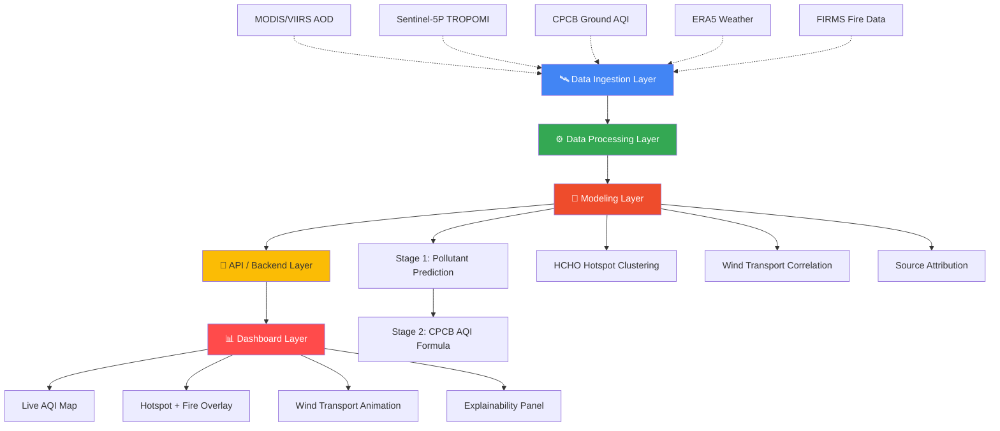
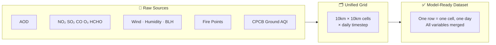
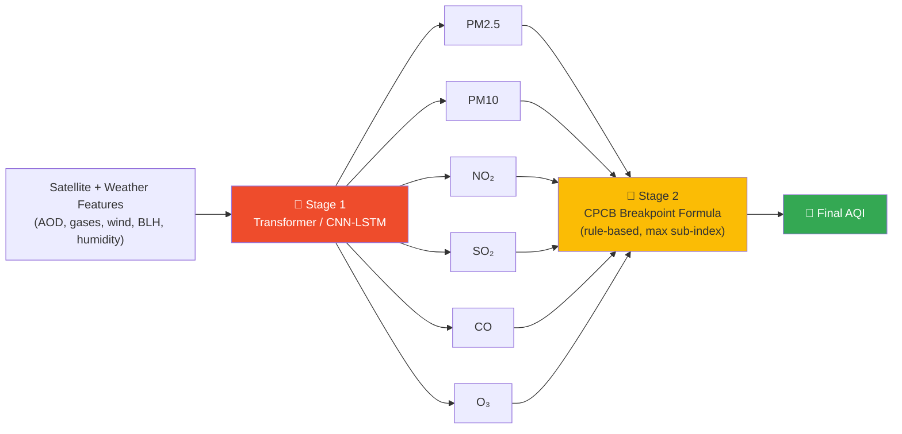
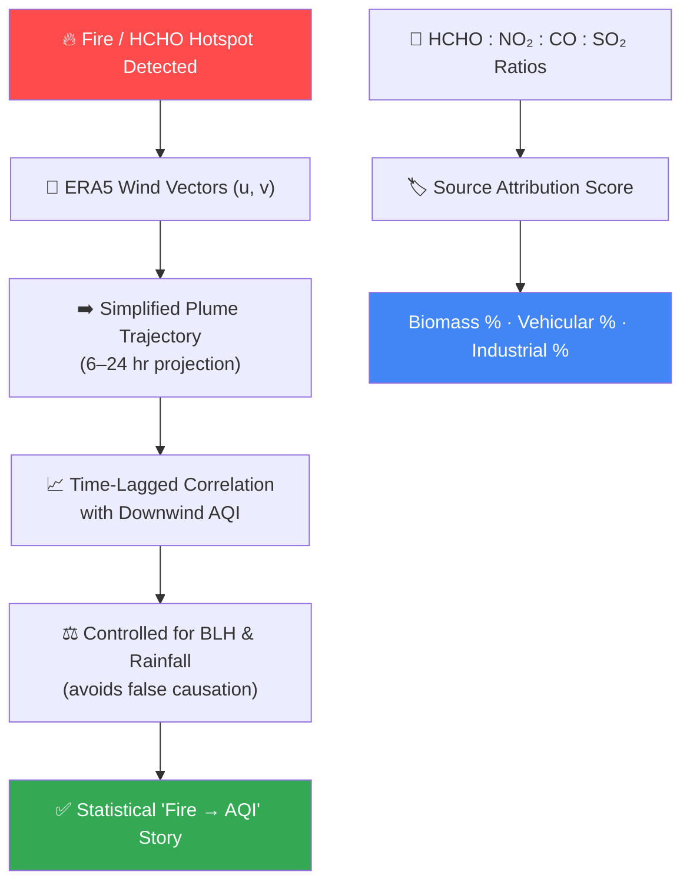

<div align="center">

# 🛰️ VayuDrishti

### AI-Driven Surface AQI Estimation & HCHO Hotspot Detection Platform

*Turning satellite eyes in the sky into ground-level answers for every corner of India.*


**GGSIPU2603** · University School of Automation & Robotics (USAR), GGSIPU
Remote Sensing · Geospatial AI · Deep Learning · Atmospheric Science

</div>

<br>

---

## 📖 Table of Contents

- [The Problem, In One Look](#-the-problem-in-one-look)
- [System Architecture](#️-system-architecture)
- [Data Flow Pipeline](#-data-flow-pipeline)
- [AQI Model — Two-Stage Design](#-aqi-model--two-stage-design)
- [Wind Transport & Source Attribution](#-wind-transport--source-attribution)
- [Tech Stack at a Glance](#️-tech-stack-at-a-glance)
- [Dashboard Wireframe](#-dashboard-wireframe)
- [Unique Features](#-unique-features)
- [Folder Structure](#-folder-structure)
- [Team](#-team)

---

## 🎯 The Problem, In One Look

<table>
<tr>
<td width="50%" valign="top">

**What India has**

- 📡 Full-country satellite coverage (INSAT-3D, Sentinel-5P)
- 📍 <500 ground AQI stations, mostly in metros
- 🔥 Seasonal stubble burning with unclear AQI impact

</td>
<td width="50%" valign="top">

**What VayuDrishti adds**

- 🗺️ AQI estimated at *every* grid cell, not just station points
- 🧬 HCHO hotspots traced back to biomass burning
- 💨 Wind-based cause → effect story, not just two static maps

</td>
</tr>
</table>

> **In short:** satellites already see all of India. VayuDrishti teaches a model to translate what they see into the ground-level number that actually matters — and explains *why* that number is what it is.

---

## 🏗️ System Architecture



---

## 🔄 Data Flow Pipeline



**Why this matters:** every source arrives at a different resolution and revisit time. Regridding onto one common spatial-temporal frame is the unglamorous but essential step that makes everything downstream possible.

---

## 🧪 AQI Model — Two-Stage Design

> India's official AQI isn't one smooth number — it's the **maximum sub-index** across 8 pollutants. So the model doesn't predict AQI directly. It predicts the *ingredients*, then applies the *real formula*.



| Stage | What It Does | Why |
| --- | --- | --- |
| **1 — Learned** | Deep model predicts real pollutant concentrations | Physically grounded, matches what satellites actually measure |
| **2 — Rule-based** | Official CPCB formula computes the final AQI | Auditable, explainable, exactly matches how India defines AQI |

---

## 💨 Wind Transport & Source Attribution



---

## 🛠️ Tech Stack at a Glance

<table>
<tr><th>Layer</th><th>Tools</th></tr>
<tr><td>🛰️ <b>Ingestion</b></td><td>Google Earth Engine · Copernicus CDS · NASA FIRMS · CPCB CCR</td></tr>
<tr><td>⚙️ <b>Processing</b></td><td>Pandas · GeoPandas · Rasterio/GDAL · xarray</td></tr>
<tr><td>🧠 <b>Modeling</b></td><td>PyTorch · Scikit-learn · XGBoost · SHAP</td></tr>
<tr><td>📍 <b>Spatial Analysis</b></td><td>DBSCAN · GeoPandas</td></tr>
<tr><td>🔌 <b>Backend (MVP)</b></td><td>GeoParquet + Pandas (no server needed for demo)</td></tr>
<tr><td>📊 <b>Dashboard</b></td><td>Streamlit · Plotly · Folium</td></tr>
<tr><td>🗺️ <b>GIS/Reporting</b></td><td>QGIS</td></tr>
</table>

---

## 🖥️ Dashboard Wireframe

```
┌──────────────────────────────────────────────────────────────┐
│  🛰️ VayuDrishti          📍 Region: [Delhi-NCR ▾]  📅 [Date ▾] │
├───────────────────────────────┬────────────────────────────────┤
│                                │  📊 AQI Trend (7-day)           │
│                                │  ╭─────────────────────╮       │
│        🗺️  MAP VIEW            │  │      ╱╲    ╱╲        │       │
│    ▢ AQI Heatmap               │  │  ╱╲╱    ╲╱    ╲      │       │
│    ▢ HCHO Hotspots             │  ╰─────────────────────╯       │
│    ▢ Fire Points               │                                │
│    ▢ Wind Vectors              │  🏷️ Source Attribution          │
│                                │  Biomass  ████████░░  62%      │
│    🔥→💨→📈  Transport arrow    │  Vehicular ███░░░░░░░  24%      │
│    animating fire → AQI spike  │  Industrial ██░░░░░░░  14%      │
│                                │                                │
│                                │  🧠 Why this AQI? (SHAP)        │
│                                │  AOD ████████  Wind ███  BLH ██ │
└───────────────────────────────┴────────────────────────────────┘
```

---

## ✨ Unique Features

| | Feature | One-Line Pitch |
| --- | --- | --- |
| 🌬️ | **Wind Transport Tracker** | Shows *this fire caused that AQI spike*, not just two disconnected maps |
| 🏷️ | **Source Attribution Score** | Splits AQI into biomass / vehicular / industrial % per region |
| 🔮 | **48-Hour Forecast** | Proactive alerts, not just reactive reporting |
| 🏥 | **Health-Risk Exposure Alerts** | Flags AQI breaches near schools & hospitals |
| 📋 | **NCAP Compliance Flagging** | Auto-checks cities against official reduction targets |
| 🧠 | **SHAP Explainability** | Every prediction comes with "why," not just "what" |
| 🧩 | **Multi-Sensor Gap-Filling** | Handles cloud-cover data gaps gracefully |

---

## 📁 Folder Structure

```
vayudrishti/
├── data_ingestion/      # GEE, CPCB, ERA5, FIRMS pull scripts
├── data_processing/      # Grid building + merging
├── models/                # AQI model, hotspot detection, transport, attribution, SHAP
├── backend/                # (future) FastAPI service
├── dashboard/                # Streamlit app
├── reports/                    # Technical report + exported maps
└── README.md
```

---

<div align="center">

## 👥 Team

Team name :- Team KodeShetra
members :- Prince , Ankur Ojha , Neha , Yash Dhollakhandi

<br>

**Built with 🛰️ + 🧠 + 💨 for cleaner air across India**

</div>
