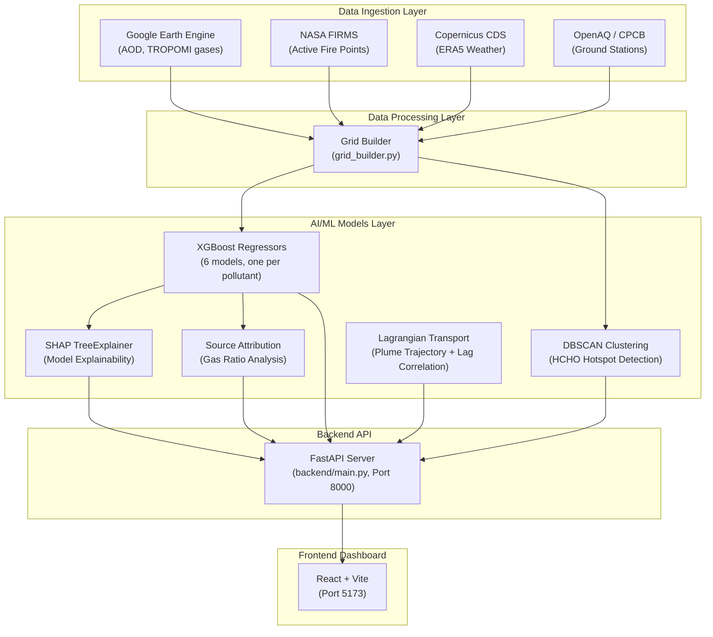

# VayuDrishti — Complete Project Deep Dive

> **Project Code:** GGSIPU2603 (SIH 2026 Hackathon Submission)
> **Domain:** Remote Sensing, Geospatial AI, Atmospheric Science
> **Pilot Region:** Delhi-NCR + Punjab + Haryana (Oct–Nov stubble burning season)

---

## 1. What Is This Project?

VayuDrishti is an **AI-driven surface Air Quality Index (AQI) estimation and pollution source tracking platform**. It solves a critical real-world problem:

> India has < 500 CPCB ground-level air monitoring stations for 1.4 billion people. Most districts — especially rural ones — have **zero real-time AQI visibility**.

This platform **converts satellite atmospheric measurements into ground-level AQI estimates** using machine learning, detects formaldehyde (HCHO) hotspots linked to crop-residue (stubble) burning, traces how pollution physically travels downwind, and presents everything through an interactive dashboard.

---

## 2. Architecture Overview



---

## 3. Data Flow — Step by Step

### Step 1: Data Ingestion ([data_ingestion/](file:///c:/Users/HP/OneDrive/Desktop/SIH2026/data_ingestion))

Four scripts pull data from external sources (currently configured to run in **offline simulator mode** for the hackathon):

| Script | Source | What It Fetches |
|--------|--------|-----------------|
| [gee_pull.py](file:///c:/Users/HP/OneDrive/Desktop/SIH2026/data_ingestion/gee_pull.py) | Google Earth Engine | **Satellite columns**: MODIS AOD (Aerosol Optical Depth), Sentinel-5P TROPOMI trace gases (HCHO, NO₂, SO₂, CO, O₃) |
| [firms_pull.py](file:///c:/Users/HP/OneDrive/Desktop/SIH2026/data_ingestion/firms_pull.py) | NASA FIRMS | **Active fire points**: MODIS/VIIRS thermal anomalies with Fire Radiative Power (FRP) and confidence |
| [era5_pull.py](file:///c:/Users/HP/OneDrive/Desktop/SIH2026/data_ingestion/era5_pull.py) | Copernicus CDS | **Weather reanalysis**: Wind u/v components, boundary layer height (BLH), temperature, humidity, precipitation |
| [cpcb_pull.py](file:///c:/Users/HP/OneDrive/Desktop/SIH2026/data_ingestion/cpcb_pull.py) | OpenAQ API | **Ground truth**: CPCB station-measured PM2.5, PM10, NO₂, SO₂, CO, O₃ concentrations |

### Step 2: Grid Builder & Physical Simulation ([data_processing/grid_builder.py](file:///c:/Users/HP/OneDrive/Desktop/SIH2026/data_processing/grid_builder.py))

Since real satellite API access requires pre-approved credentials, the grid builder generates a **physically realistic synthetic dataset** for 15 districts across 61 days (Oct 1 – Nov 30, 2025):

1. **Spatial Grid**: Creates a 0.15° × 0.15° grid covering lat 27.6°–32.4°, lon 73.8°–77.8° (~850+ cells). Each cell is assigned to the nearest of 15 predefined districts (Delhi, Gurugram, Ludhiana, Amritsar, etc.) with a land-use type (urban / industrial / agricultural / rural).

2. **Fire Simulation**: Generates **thousands of fire events** following the real stubble burning timeline:
   - Early Oct: 1–10 fires/day
   - Late Oct – mid Nov: **100–300 fires/day** (peak season)
   - Late Nov: 2–15 fires/day
   - 70% of fires placed in **Punjab agricultural** districts, 30% in **Haryana**

3. **Weather Simulation**: Daily weather parameters with realistic seasonal progression:
   - Temperature: Drops from 32°C → ~19°C (winter onset)
   - BLH: Drops from ~1300m → ~200m (atmospheric inversion traps pollutants)
   - Wind: Predominantly **north-westerly** (315° ± 20°), carrying smoke from Punjab → Delhi
   - Rain events on day 18 and 41 (wet scavenging)

4. **Pollutant Physics**: For each grid cell and each day, the builder computes:

   **A. Smoke Impact (Gaussian Plume Model)**:
   ```
   For each fire point relative to the grid cell:
   - Compute downwind projection distance
   - Compute perpendicular distance from plume centerline
   - Gaussian dispersion: plume_factor = exp(-0.5 × (perp_dist / σ_y)²)
   - Decay along distance: decay = 1 / (1 + 0.005 × dist^1.5)
   - Contribution = FRP × plume_factor × decay / √(distance_km)
   ```

   **B. Base Concentrations**: Depend on land-use type (urban: high NO₂; industrial: high SO₂; agricultural: low baseline but high smoke impact)

   **C. BLH Compression**: `concentration *= (0.4 + 0.6 × 1000/BLH)` — Lower BLH traps more pollutants near the surface

   **D. Smoke Additions**: PM2.5 += smoke × 1.2, PM10 += smoke × 1.8, CO += smoke × 0.005, etc.

   **E. Wet Scavenging**: Rain washes out pollutants: `conc *= exp(-0.15 × rainfall)`

   **F. Satellite Column Densities**: Simulates what satellites would observe: `AOD = PM2.5 × 0.004 × BLH/1000 + noise`

5. **Ground Station Data**: Extracts grid values at 12 CPCB station locations (with added noise) to create [ground_stations.csv](file:///c:/Users/HP/OneDrive/Desktop/SIH2026/data/ground_stations.csv) for model training.

**Output files:**
- `data/grid_data.csv` — Full gridded dataset (~50k+ rows)
- `data/fire_events.csv` — All simulated fire events (~8k+ rows)
- `data/ground_stations.csv` — Sparse station observations for training

---

## 4. AI/ML Models — Deep Dive

### 🤖 Model 1: XGBoost Surface Pollutant Regressors ([aqi_model.py](file:///c:/Users/HP/OneDrive/Desktop/SIH2026/models/aqi_model.py))

**Purpose**: Convert satellite column measurements + weather data → ground-level pollutant concentrations

**This is the core AI of the project.** Six separate XGBoost models are trained, one for each pollutant:
- `pm25_xgb.pkl` → Predicts surface PM2.5 (µg/m³)
- `pm10_xgb.pkl` → Predicts surface PM10 (µg/m³)
- `no2_surface_xgb.pkl` → Predicts surface NO₂ (µg/m³)
- `so2_surface_xgb.pkl` → Predicts surface SO₂ (µg/m³)
- `co_surface_xgb.pkl` → Predicts surface CO (mg/m³)
- `o3_surface_xgb.pkl` → Predicts surface O₃ (µg/m³)

**Input Features (12 satellite + weather variables)**:
```
temperature, humidity, blh, wind_u, wind_v, precipitation,
aod, no2_column, so2_column, co_column, o3_column, hcho_column
```

**Training Strategy**: **Spatial GroupKFold Cross-Validation** (5 folds)
- Groups = district names → ensures that during each validation fold, an **entire district's data is held out**
- This prevents spatial data leakage (nearby stations producing artificially high accuracy)
- Reports spatially-honest RMSE and R² per pollutant

**Hyperparameters**: `n_estimators=100, learning_rate=0.08, max_depth=5`

**AQI Calculation (CPCB Standard — Rule-Based, NOT ML)**:

After predicting the 6 surface concentrations, the system applies India's official **CPCB AQI formula**:

1. For each pollutant, compute a **sub-index** using CPCB breakpoint tables:
   ```
   Sub-Index = I_lo + ((I_hi - I_lo) / (B_hi - B_lo)) × (C - B_lo)
   ```
   where `C` = predicted concentration, `B` = breakpoint range, `I` = index range

2. **Composite AQI = max(all 6 sub-indices)** — the worst pollutant drives the AQI

3. AQI categorized as: Good (0-50), Satisfactory (51-100), Moderate (101-200), Poor (201-300), Very Poor (301-400), Severe (401-500)

> [!IMPORTANT]
> The project does NOT predict AQI directly via regression. It predicts individual pollutant concentrations first, then applies the exact CPCB rule-based formula. This is intentional — direct AQI regression would poorly approximate a discontinuous max-of-sub-indices function.

---

### 🤖 Model 2: DBSCAN Hotspot Detection ([hotspot_detection.py](file:///c:/Users/HP/OneDrive/Desktop/SIH2026/models/hotspot_detection.py))

**Purpose**: Identify spatial clusters of high HCHO concentration (indicating active biomass burning)

**Algorithm**: DBSCAN (Density-Based Spatial Clustering of Applications with Noise)

**How it works**:
1. Filter grid cells above the **85th percentile** of HCHO column density for that day
2. Run DBSCAN on the (longitude, latitude) coordinates of high-HCHO cells:
   - `eps = 0.3°` (~33 km radius)
   - `min_samples = 2`
3. **Cross-reference with FIRMS fire data**: For each detected cluster, check if any active fire points exist within 0.35° (~40 km). If yes → mark as **"biomass-driven"**

**Output per hotspot**: cluster_id, is_hotspot, is_biomass_driven, associated_fires count

> [!NOTE]
> HCHO (formaldehyde) is a key tracer gas for biomass combustion. High HCHO + nearby active fires = strong evidence of crop-residue burning.

---

### 🤖 Model 3: SHAP Explainability ([explainability.py](file:///c:/Users/HP/OneDrive/Desktop/SIH2026/models/explainability.py))

**Purpose**: Make the XGBoost predictions interpretable — answer "WHY is AQI high here?"

**Technology**: **SHAP (SHapley Additive exPlanations) with TreeExplainer**

**How it works**:
1. For a selected grid cell, identify the **dominant pollutant** (the one with the highest sub-index)
2. Load the corresponding XGBoost model's SHAP TreeExplainer
3. Compute SHAP values for each of the 12 input features
4. Return a sorted dictionary: `{feature_name: shap_contribution}`

**Example output**:
```json
{
  "pollutant": "PM25",
  "base_value": 45.0,
  "prediction_value": 127.5,
  "shap_values": {
    "aod": +35.2,        ← "High aerosol load pushed PM2.5 up"
    "blh": -18.4,        ← "Low boundary layer trapped pollution"
    "wind_u": -8.1,      ← "Wind direction brought upwind smoke"
    "hcho_column": +6.7  ← "Nearby burning activity"
  }
}
```

> This directly addresses the critical question: **"How do we trust this AQI number?"**

---

### 🤖 Model 4: Source Attribution ([source_attribution.py](file:///c:/Users/HP/OneDrive/Desktop/SIH2026/models/source_attribution.py))

**Purpose**: Decompose "WHY is AQI bad?" into **Biomass% + Vehicular% + Industrial%**

**Method**: Rule-based chemical signature analysis (NOT a trained ML model)

**Rationale**:
- **HCHO** = biomass combustion tracer (formaldehyde from organic matter burning)
- **NO₂** = high-temperature fossil-fuel combustion tracer (vehicles, power plants)
- **SO₂** = sulfur-rich fuel tracer (coal/industrial burning)
- **CO** = general combustion indicator

**Algorithm**:
1. Start with **baseline percentages** based on land-use type:
   - Urban: 60% vehicular, 25% industrial, 15% biomass
   - Industrial: 25% vehicular, 65% industrial, 10% biomass
   - Agricultural: 20% vehicular, 15% industrial, 65% biomass

2. Add **chemical signal weights**:
   ```
   biomass_signal = HCHO × 2.5 + smoke_impact × 0.08
   vehicular_signal = NO₂ × 3.5 + CO × 0.8
   industrial_signal = SO₂ × 6.0 + NO₂ × 0.5
   ```

3. In heavy smoke conditions (smoke > 30), **reduce vehicular weight** (smoke overwhelms local traffic signal)

4. Normalize all three to sum to 100%

---

### 🤖 Model 5: Wind Transport & Lagrangian Plume Modeling ([transport_model.py](file:///c:/Users/HP/OneDrive/Desktop/SIH2026/models/transport_model.py))

**Purpose**: Trace how smoke from a fire travels downwind, and statistically prove the causal link between Punjab fires and Delhi AQI spikes

**Part A — Plume Trajectory Projection**:
- Takes a fire's (lat, lon) and wind (u, v) components
- Projects the plume path over 18–24 hours in 3-hour steps
- Uses real coordinate conversion: `Δlat = v × time / 111000m`, `Δlon = u × time / (111000 × cos(lat))m`
- Bounds-checked within India (20°–36° lat, 68°–98° lon)

**Part B — Lagged Causal Correlation Analysis**:

This is the most scientifically rigorous part:

1. Aggregate daily **total FRP** (fire intensity) in Punjab
2. Aggregate daily **average AQI** in Delhi
3. For lag = 0, 1, 2, 3 days:
   - Shift Punjab FRP forward by `lag` days
   - Compute **raw Pearson correlation** with Delhi AQI
   - Compute **partial correlation** (controlling for BLH and precipitation):
     ```
     1. Regress FRP on [BLH, precipitation] → get residuals_fire
     2. Regress AQI on [BLH, precipitation] → get residuals_aqi
     3. Correlation(residuals_fire, residuals_aqi) = partial_correlation
     ```
   - This isolates the fire → AQI signal from confounding meteorology

> [!TIP]
> The partial correlation at lag=1 day typically shows the strongest signal — smoke emitted today in Punjab reaches Delhi tomorrow.

---

## 5. Backend API Endpoints ([backend/main.py](file:///c:/Users/HP/OneDrive/Desktop/SIH2026/backend/main.py))

On startup, the FastAPI server:
1. Loads all CSV data into memory
2. Loads all 6 XGBoost models
3. Initializes SHAP explainers
4. **Precomputes predictions and source attribution** for the entire grid (cached in RAM)

| Endpoint | Returns |
|----------|---------|
| `GET /api/metadata` | Available dates, states, districts |
| `GET /api/dashboard?date=&district=` | KPIs (AQI, PM2.5, PM10, fires, wind), focus district metrics, 7-day trends, SHAP explanation, source attribution |
| `GET /api/map-data?date=&state=` | All grid cells (lat/lon/AQI/PM), active fires, HCHO hotspots, plume trajectories, wind vectors |
| `GET /api/hotspots?date=` | DBSCAN-detected HCHO hotspot clusters with biomass-driven flags |
| `GET /api/fires?date=` | Active MODIS/VIIRS fire points with FRP and confidence |
| `GET /api/wind?date=` | Plume trajectory paths + Punjab→Delhi lag correlation analysis |
| `GET /api/attribution?date=&state=` | Per-district source breakdown (biomass%, vehicular%, industrial%) |
| `GET /api/compliance?date=&district=` | 30-day rolling AQI average, NCAP target compliance, sensitive receptor alerts |
| `GET /api/data-explorer?page=&limit=` | Paginated raw grid data for research export |

---

## 6. Frontend Dashboard Sections

### 📊 Dashboard ([DashboardView.jsx](file:///c:/Users/HP/OneDrive/Desktop/SIH2026/frontend/src/components/DashboardView.jsx))
- **Top KPI Cards**: Real-time Delhi AQI, PM2.5, PM10, HCHO hotspot count, active fires, wind speed — each with 7-day sparkline charts
- **Interactive Map**: Leaflet map with AQI-colored grid cells, fire markers (🔥), hotspot markers, and plume trajectory lines
- **Right Panel**: Focus district deep-dive with pollutant breakdown, source attribution donut chart, SHAP feature importance bar chart, and 7-day AQI trend line chart
- **Pollutant selector**: PM2.5 / PM10 / HCHO tabs to switch the map layer

### 🗺️ Live Map ([LiveMapView.jsx](file:///c:/Users/HP/OneDrive/Desktop/SIH2026/frontend/src/components/LiveMapView.jsx))
- Full-screen Leaflet map with toggleable layers: AQI heatmap, fire points, HCHO hotspots, wind vectors, smoke plume trajectories
- Layer selector panel for turning visibility on/off

### 🔥 Fire Detection ([FiresView.jsx](file:///c:/Users/HP/OneDrive/Desktop/SIH2026/frontend/src/components/FiresView.jsx))
- Map showing all MODIS/VIIRS detected active fire points
- Fire details table with FRP (fire intensity), confidence score, and sensor type
- Fire count statistics

### 🎯 HCHO Hotspots ([HotspotsView.jsx](file:///c:/Users/HP/OneDrive/Desktop/SIH2026/frontend/src/components/HotspotsView.jsx))
- DBSCAN cluster visualization on map
- Table showing each cluster's district, HCHO level, biomass-driven flag
- Cluster member expansion (click to see all grid cells in a cluster)

### 📈 District Analytics ([DistrictAnalyticsView.jsx](file:///c:/Users/HP/OneDrive/Desktop/SIH2026/frontend/src/components/DistrictAnalyticsView.jsx))
- Comparative bar charts across all 15 districts
- Side-by-side AQI, PM2.5, PM10 comparison

### 🌬️ Wind Transport ([TransportView.jsx](file:///c:/Users/HP/OneDrive/Desktop/SIH2026/frontend/src/components/TransportView.jsx))
- Smoke plume trajectory visualization (animated paths from fire points)
- **Lag correlation chart**: Bar chart showing raw vs. partial correlation at 0–3 day lags
- Demonstrates the Punjab fires → Delhi AQI causal narrative

### 🧪 Source Attribution ([AttributionView.jsx](file:///c:/Users/HP/OneDrive/Desktop/SIH2026/frontend/src/components/AttributionView.jsx))
- Stacked bar chart showing Biomass% / Vehicular% / Industrial% per district
- Filtered by state

### 🔮 AQI Forecast ([ForecastView.jsx](file:///c:/Users/HP/OneDrive/Desktop/SIH2026/frontend/src/components/ForecastView.jsx))
- 48-hour proactive AQI forecast projections
- Combines weather forecast trends with recent fire/emission patterns

### 📋 Reports ([ReportsView.jsx](file:///c:/Users/HP/OneDrive/Desktop/SIH2026/frontend/src/components/ReportsView.jsx))
- NCAP compliance status — 30-day rolling AQI average vs. target (120)
- Compliance flag: ✅ Compliant or ⚠️ Non-Compliant
- Export report functionality

### 🚨 Alerts ([AlertsView.jsx](file:///c:/Users/HP/OneDrive/Desktop/SIH2026/frontend/src/components/AlertsView.jsx))
- Sensitive receptor proximity alerts — fires/hotspots near hospitals and schools
- Predefined receptor database (Venkateshwar Hospital, DPS RK Puram, Fortis, etc.)
- Distance-based alert triggers

### 📊 Data Explorer ([DataExplorerView.jsx](file:///c:/Users/HP/OneDrive/Desktop/SIH2026/frontend/src/components/DataExplorerView.jsx))
- Paginated raw data table for researchers
- Full grid data with all pollutant columns, searchable/sortable

### ⚙️ Settings ([SettingsView.jsx](file:///c:/Users/HP/OneDrive/Desktop/SIH2026/frontend/src/components/SettingsView.jsx))
- Configurable parameters: NCAP target, HCHO percentile threshold, alert radius
- Save configuration

---

## 7. AI/ML Summary Table

| Component | Technology | Type | Purpose |
|-----------|-----------|------|---------|
| Surface Pollutant Estimation | **XGBoost** (6 models) | ✅ **Trained ML Model** | Convert satellite columns → ground-level PM2.5, PM10, NO₂, SO₂, CO, O₃ |
| AQI Calculation | CPCB Breakpoint Formula | ❌ Rule-based (not ML) | Official Indian AQI from predicted concentrations |
| HCHO Hotspot Detection | **DBSCAN** (sklearn) | ✅ **ML Clustering** | Find spatial clusters of high formaldehyde indicating burning |
| Model Explainability | **SHAP TreeExplainer** | ✅ **ML Interpretability** | Explain which features drove each AQI prediction |
| Source Attribution | Gas Ratio Analysis | ❌ Rule-based heuristic | Decompose AQI into Biomass/Vehicular/Industrial |
| Plume Transport | Lagrangian Advection | ❌ Physics-based model | Trace smoke trajectory using wind vectors |
| Causal Correlation | **Partial Correlation** (LinearRegression) | ✅ **Statistical ML** | Prove fire-AQI causal link, controlling for weather confounders |
| Fire Detection | MODIS/VIIRS (satellite) | ❌ External data | Thermal anomaly detection from NASA satellites |

---

## 8. Key Calculations Explained

### Gaussian Plume Dispersion (Grid Builder)
```
For each (fire, grid_cell) pair:
  proj_dist = dot(displacement_vector, wind_direction_unit) × 111 km/deg
  perp_dist = cross(displacement_vector, wind_direction_unit) × 111 km/deg
  σ_y = 1.5 + 0.1 × max(0, proj_dist)           ← plume widens downwind
  plume_factor = exp(-0.5 × (perp_dist / σ_y)²)  ← Gaussian lateral spread
  decay_factor = 1 / (1 + 0.005 × proj_dist^1.5)  ← concentration drops with distance
  contribution = FRP × plume_factor × decay / √(dist_km)

Total smoke_impact = Σ all fire contributions (capped at 800)
```

### BLH Compression Effect
```
blh_compression = 1000 / BLH_meters
PM2.5_adjusted = PM2.5_base × (0.4 + 0.6 × blh_compression)
```
When BLH drops from 1000m → 200m, the compression factor goes from 1.0 → 3.4, **trapping 3.4× more pollution near the surface**.

### Wet Scavenging (Rain Washout)
```
washout = exp(-0.15 × rainfall_mm)
All pollutant concentrations × washout
```
10mm of rain reduces pollutants to ~22% of pre-rain levels.

---

## 9. How To Run

```bash
# Terminal 1 — Backend
cd backend
pip install -r requirements.txt
python main.py                    # Starts FastAPI on port 8000

# Terminal 2 — Frontend
cd frontend
npm install
npm run dev                       # Starts Vite dev server on port 5173

# First-time data generation (if data/ is empty)
python data_processing/grid_builder.py   # Generates synthetic data
python verify_models.py                  # Trains models + verifies pipeline
```

---

## 10. What Makes This Project Stand Out

1. **Two-stage AQI estimation** (ML predictions → rule-based CPCB formula) instead of naive end-to-end regression
2. **Spatial GroupKFold validation** prevents data leakage from nearby stations
3. **Partial correlation analysis** isolates the fire→AQI causal signal from confounding meteorology
4. **SHAP explainability** makes every AQI prediction transparent and trustworthy
5. **Full physics simulation** generates training data that follows real atmospheric chemistry
6. **Designed for production readiness** — the data ingestion layer has real API connectors for GEE, FIRMS, ERA5, and CPCB that can replace the simulator when credentials are available
