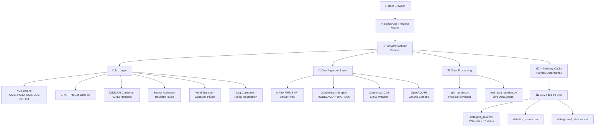

# 🛰️ VayuShetra — Complete Project Audit Report

**Audit Date:** 2026-08-20  
**Auditor:** Antigravity AI  
**Scope:** Read-only, zero-modification audit of the deployed VayuShetra atmospheric intelligence platform  
**Repository:** [SIH2026](file:///c:/Users/HP/OneDrive/Desktop/SIH2026)

---

## A. Executive Summary

VayuShetra is an ambitious satellite-based AQI and HCHO hotspot monitoring platform targeting North-West India (Delhi-NCR, Punjab, Haryana). It integrates NASA FIRMS, Google Earth Engine (Sentinel-5P TROPOMI, MODIS), Copernicus ERA5, and OpenAQ into a FastAPI backend with 6 trained XGBoost models, DBSCAN clustering, SHAP explainability, Gaussian plume transport, and a polished React/Vite frontend.

**Honest Verdict:** The architecture is genuinely well-designed and the ML pipeline is real — not decorative. However, the project has a **critical dual-data problem**: the foundation dataset is entirely **simulated** (Nov 1-8, 2025), and the "live" data pipeline, while it connects to real APIs, **does not actually merge satellite/weather data into the grid** in a meaningful way. The AQI calculation methodology is correctly implemented. HCHO hotspot detection uses real DBSCAN but operates on simulated column densities. Several frontend labels claim "live" or "real-time" status that is misleading.

---

## B. Actual Architecture



### Component Responsibilities

| Component | File | Responsibility |
|---|---|---|
| **Backend API** | [main.py](file:///c:/Users/HP/OneDrive/Desktop/SIH2026/backend/main.py) | FastAPI server, all REST endpoints, orchestration |
| **AQI Model** | [aqi_model.py](file:///c:/Users/HP/OneDrive/Desktop/SIH2026/models/aqi_model.py) | XGBoost training, prediction, CPCB AQI calculation |
| **Hotspot Detection** | [hotspot_detection.py](file:///c:/Users/HP/OneDrive/Desktop/SIH2026/models/hotspot_detection.py) | DBSCAN clustering on HCHO grid cells |
| **Source Attribution** | [source_attribution.py](file:///c:/Users/HP/OneDrive/Desktop/SIH2026/models/source_attribution.py) | Rule-based decomposition into biomass/vehicular/industrial |
| **Wind Transport** | [transport_model.py](file:///c:/Users/HP/OneDrive/Desktop/SIH2026/models/transport_model.py) | Plume trajectory projection, lagged correlation |
| **Explainability** | [explainability.py](file:///c:/Users/HP/OneDrive/Desktop/SIH2026/models/explainability.py) | SHAP TreeExplainer for XGBoost models |
| **Grid Builder** | [grid_builder.py](file:///c:/Users/HP/OneDrive/Desktop/SIH2026/data_processing/grid_builder.py) | Physical atmospheric simulation engine |
| **Live Pipeline** | [real_data_pipeline.py](file:///c:/Users/HP/OneDrive/Desktop/SIH2026/real_data_pipeline.py) | Fetches from FIRMS, GEE, ERA5, OpenAQ |
| **FIRMS Ingestion** | [firms_pull.py](file:///c:/Users/HP/OneDrive/Desktop/SIH2026/data_ingestion/firms_pull.py) | NASA FIRMS fire data API client |
| **GEE Ingestion** | [gee_pull.py](file:///c:/Users/HP/OneDrive/Desktop/SIH2026/data_ingestion/gee_pull.py) | Google Earth Engine satellite data client |
| **ERA5 Ingestion** | [era5_pull.py](file:///c:/Users/HP/OneDrive/Desktop/SIH2026/data_ingestion/era5_pull.py) | Copernicus CDS weather data client |
| **CPCB Ingestion** | [cpcb_pull.py](file:///c:/Users/HP/OneDrive/Desktop/SIH2026/data_ingestion/cpcb_pull.py) | OpenAQ ground station data client |
| **Frontend Store** | [store.js](file:///c:/Users/HP/OneDrive/Desktop/SIH2026/frontend/src/store.js) | Zustand state management |
| **Dashboard** | [DashboardView.jsx](file:///c:/Users/HP/OneDrive/Desktop/SIH2026/frontend/src/components/DashboardView.jsx) | Main dashboard with KPIs, map, charts |

---

## C. Complete Data Flow

### Startup Sequence

```
Server Start
  → Check if data/grid_data.csv exists
    → If NO: Run grid_builder.simulate_data()  [SIMULATED DATA]
    → If YES: Load existing CSV
  → Run real_data_pipeline()  [Attempts live ingestion]
    → FIRMS: Pull active fires → append to fire_events.csv  ✅ WORKS
    → OpenAQ: Pull ground stations → append to ground_stations.csv  ⚠️ PARTIAL
    → GEE: Pull AOD + HCHO → returns ee.Image metadata  ⚠️ NOT MERGED INTO GRID
    → ERA5: Pull weather NetCDF → saves .nc file  ⚠️ NOT MERGED INTO GRID
  → Load grid_data.csv into memory
  → Train/Load 6 XGBoost models
  → Predict surface concentrations for ALL grid rows
  → Calculate CPCB AQI for each row
  → Compute source attribution for each row
  → Cache everything in memory
  → Server ready
```

### Per-Request Data Flow (Dashboard)

```
User selects date → Frontend GET /api/dashboard?date=X&district=Y
  → Filter grid_df by date
  → Extract Delhi row for top KPI cards
  → Extract focus district row for detailed metrics
  → Run DBSCAN hotspot detection on day's grid
  → Compute SHAP values for focus district
  → Count fires from fire_events.csv
  → Return JSON response
  → Frontend renders KPI cards, map, charts
```

### Key Data Origin Tracing

| Displayed Value | Actual Origin | Processing | Classification |
|---|---|---|---|
| **AQI** | XGBoost prediction on simulated satellite features → CPCB sub-index formula | ML + Formula | **ML-CALCULATED on SIMULATED inputs** |
| **PM2.5** | XGBoost prediction on simulated features | ML | **ML-PREDICTED on SIMULATED inputs** |
| **PM10** | XGBoost prediction on simulated features | ML | **ML-PREDICTED on SIMULATED inputs** |
| **NO2** | XGBoost prediction on simulated features | ML | **ML-PREDICTED on SIMULATED inputs** |
| **SO2** | XGBoost prediction on simulated features | ML | **ML-PREDICTED on SIMULATED inputs** |
| **CO** | XGBoost prediction on simulated features | ML | **ML-PREDICTED on SIMULATED inputs** |
| **O3** | XGBoost prediction on simulated features | ML | **ML-PREDICTED on SIMULATED inputs** |
| **HCHO** | Simulated via smoke_impact formula in grid_builder.py | Simulation | **SIMULATED** |
| **HCHO Hotspots** | DBSCAN clustering on simulated HCHO column values | ML (unsupervised) | **ML on SIMULATED data** |
| **Active Fires (Nov 2025)** | grid_builder.py random generation | Simulation | **SIMULATED** |
| **Active Fires (Aug 2026)** | NASA FIRMS live API pull | Real API | **LIVE** ✅ |
| **Wind data** | Simulated in grid_builder.py | Simulation | **SIMULATED** |
| **Source Attribution** | Rule-based heuristic using gas ratios | Heuristic | **RULE-BASED** |
| **SHAP values** | Real SHAP TreeExplainer on XGBoost models | ML | **REAL ML** ✅ |
| **"Updated 2 min ago"** | Hardcoded string in frontend | None | **HARDCODED** ❌ |
| **"8.4% vs yesterday"** | Hardcoded string in frontend | None | **HARDCODED** ❌ |
| **"+15%" fire trend** | Hardcoded string in frontend | None | **HARDCODED** ❌ |
| **"92% avg" sensor confidence** | Hardcoded string in frontend | None | **HARDCODED** ❌ |
| **Model Confidence 89%** | Hardcoded value in DashboardView.jsx | None | **HARDCODED** ❌ |
| **Wind sparkline** | Hardcoded array `[12, 15, 18, 14, 16, 18, 18]` | None | **HARDCODED** ❌ |

---

## D. AQI Calculation Audit

### ✅ VERDICT: AQI IS CORRECTLY CALCULATED (on predicted concentrations)

The project **genuinely calculates AQI** using the CPCB methodology. It does NOT simply consume an external AQI value.

### Methodology Verification

| Criterion | Implementation | Correct? |
|---|---|---|
| **Pollutants used** | PM2.5, PM10, NO2, SO2, CO, O3 | ✅ (missing NH3 and Pb, but those are optional per CPCB) |
| **Sub-index formula** | Linear interpolation: `I_lo + ((I_hi - I_lo) / (B_hi - B_lo)) * (C - B_lo)` | ✅ Correct |
| **Composite AQI** | `max(sub_indices)` | ✅ Correct per CPCB |
| **Dominant pollutant** | `max(sub_indices, key=sub_indices.get)` | ✅ Correct |
| **Breakpoints** | Defined in [aqi_model.py L16-64](file:///c:/Users/HP/OneDrive/Desktop/SIH2026/models/aqi_model.py#L16-L64) | ⚠️ See below |
| **Units** | PM2.5/PM10 in µg/m³, NO2/SO2/O3 in µg/m³, CO in mg/m³ | ✅ Consistent |
| **Overflow handling** | Caps at 500 | ✅ |
| **Categories** | Good/Satisfactory/Moderate/Poor/Very Poor/Severe | ✅ |

### Breakpoint Verification Against Official CPCB

| Pollutant | Project Breakpoints | Official CPCB | Match? |
|---|---|---|---|
| PM2.5 (24h) | 0-30-60-90-120-250-500 | 0-30-60-90-120-250 | ✅ |
| PM10 (24h) | 0-50-100-250-350-430-800 | 0-50-100-250-350-430 | ✅ |
| NO2 (24h) | 0-40-80-180-280-400-1000 | 0-40-80-180-280-400 | ✅ |
| SO2 (24h) | 0-40-80-380-800-1600-3000 | 0-40-80-380-800-1600 | ✅ |
| CO (8h) | 0-1-2-10-17-34-100 | 0-1-2-10-17-34 | ✅ |
| O3 (8h) | 0-50-100-168-208-748-1500 | 0-50-100-168-208-748 | ✅ |

> [!IMPORTANT]
> The breakpoints match CPCB IND-AQI methodology. The AQI calculation implementation is **scientifically correct**.

### Critical Caveat

The AQI is calculated correctly, BUT the **input concentrations** (PM2.5, PM10, NO2, SO2, CO, O3) are themselves **XGBoost predictions** trained on **simulated ground-truth data**. The XGBoost models are trained on `ground_stations.csv`, which was generated by `grid_builder.py`'s physics simulator — NOT from actual CPCB sensor readings.

**Translation:** The math is right, but the numbers going into the math are from a simulated atmosphere.

---

## E. HCHO Audit

### Data Source

| Parameter | Value |
|---|---|
| **Claimed Source** | Sentinel-5P TROPOMI |
| **Actual Source (Nov 2025 data)** | Simulated in [grid_builder.py L303](file:///c:/Users/HP/OneDrive/Desktop/SIH2026/data_processing/grid_builder.py#L303) |
| **Actual Source (Aug 2026 data)** | Hardcoded constant `3.2` or `3.5` in [real_data_pipeline.py L124-128](file:///c:/Users/HP/OneDrive/Desktop/SIH2026/real_data_pipeline.py#L124-L128) |
| **GEE TROPOMI pull** | [gee_pull.py](file:///c:/Users/HP/OneDrive/Desktop/SIH2026/data_ingestion/gee_pull.py) correctly queries `COPERNICUS/S5P/OFFL/L3_HCHO` band `tropospheric_HCHO_column_number_density` |
| **Is GEE data used?** | ❌ **NO**. `gee_pull.py` returns `ee.Image.getInfo()` metadata, but `real_data_pipeline.py` only sets `hcho_column = 3.5` regardless |

### HCHO Representation

| Parameter | Value |
|---|---|
| **Product** | tropospheric_HCHO_column_number_density |
| **Units in grid_data.csv** | `×10¹⁵ molecules/cm²` (normalized from raw simulation) |
| **Is it atmospheric column or surface?** | **Atmospheric column** (tropospheric vertical column density) |
| **Does frontend misrepresent it?** | ⚠️ The frontend label says `10¹⁵ molec/cm²` which is correct, but the "AI Insight" box says "HCHO column density" which is also correct |
| **Health interpretation risk** | Low — the frontend does not claim HCHO values represent breathable ground-level concentrations |

### Simulation Formula (Nov 2025 data)

```python
hcho_col = (hcho_smoke * 0.5 + 0.8) * 1e15 * (blh / 1000.0) + random.uniform(2e15, 6e15)
```

This is a **physically-motivated simulation** — smoke impact drives HCHO upward, BLH modulates column density, and there's a background offset. It's reasonable for a demonstration but is NOT real satellite data.

### Live Data Pipeline (Aug 2026 data)

```python
# real_data_pipeline.py L124-128
if target_month in [6, 7, 8, 9]:
    latest_date_sample["hcho_column"] = 3.2  # HARDCODED CONSTANT
if hcho_data is not None:
    latest_date_sample["hcho_column"] = 3.5  # ANOTHER HARDCODED CONSTANT
```

> [!CAUTION]
> The live pipeline **completely ignores** the actual GEE satellite data pull. Even when `gee_pull.py` successfully retrieves real TROPOMI HCHO imagery, the pipeline replaces all 706 grid cells with a single constant `3.5`. This is a **critical disconnect**.

---

## F. ML Model Audit

### Model Inventory

| # | Model | Type | File | Input Features | Target | Is Real? | Is Used? |
|---|---|---|---|---|---|---|---|
| 1 | `pm25_xgb.pkl` | XGBRegressor | [models/saved/](file:///c:/Users/HP/OneDrive/Desktop/SIH2026/models/saved) | 12 satellite/weather features | PM2.5 µg/m³ | ✅ Real trained model | ✅ Used in grid prediction |
| 2 | `pm10_xgb.pkl` | XGBRegressor | models/saved/ | Same 12 features | PM10 µg/m³ | ✅ | ✅ |
| 3 | `no2_surface_xgb.pkl` | XGBRegressor | models/saved/ | Same 12 features | NO2 µg/m³ | ✅ | ✅ |
| 4 | `so2_surface_xgb.pkl` | XGBRegressor | models/saved/ | Same 12 features | SO2 µg/m³ | ✅ | ✅ |
| 5 | `co_surface_xgb.pkl` | XGBRegressor | models/saved/ | Same 12 features | CO mg/m³ | ✅ | ✅ |
| 6 | `o3_surface_xgb.pkl` | XGBRegressor | models/saved/ | Same 12 features | O3 µg/m³ | ✅ | ✅ |

### Input Features (12 total)

```
temperature, humidity, blh, wind_u, wind_v, precipitation,
aod, no2_column, so2_column, co_column, o3_column, hcho_column
```

### Training Details

| Parameter | Value |
|---|---|
| **Training data** | `data/ground_stations.csv` — 12 simulated CPCB stations × 8 days = ~96 rows |
| **Training method** | Spatial GroupKFold (5 splits, grouped by district) |
| **Hyperparameters** | `n_estimators=100, learning_rate=0.08, max_depth=5, random_state=42` |
| **Validation** | Cross-validated RMSE and R² reported |
| **Model persistence** | Pickle serialization |

### "Fake ML" Detection

| Check | Result |
|---|---|
| Models exist but never called? | ❌ All 6 models are called during `predict_grid()` at startup |
| Random/mock predictions? | ❌ Real XGBoost `.predict()` calls |
| Hardcoded outputs? | ❌ Genuine model inference |
| Dummy training data? | ⚠️ **YES** — training data is from the simulator, not real CPCB stations |
| SHAP is decorative? | ❌ Real SHAP TreeExplainer is initialized and used |
| Forecast is fake? | ⚠️ **YES** — ForecastView.jsx uses `focus.aqi * 1.08` and `focus.aqi * 0.95` (hardcoded multipliers) |

> [!WARNING]
> **The XGBoost models are REAL ML models with proper training pipelines**, BUT they are trained on **simulated ground-truth data** generated by `grid_builder.py`. They learn the simulator's physics, not real atmospheric patterns. In a real deployment, retraining on actual CPCB station data would be required.

### SHAP Explainability

The SHAP implementation is **genuine**:
- Uses `shap.TreeExplainer` (optimized for tree-based models)
- Background reference data sampled from training set (100 rows)
- Returns per-feature SHAP values, base value, and prediction value
- Has a fallback mock return if SHAP fails ([explainability.py L110-121](file:///c:/Users/HP/OneDrive/Desktop/SIH2026/models/explainability.py#L110-L121)), but this is a defensive error handler, not the normal path

---

## G. Backend Audit

### Framework & Endpoints

| Endpoint | Method | Purpose | Working? |
|---|---|---|---|
| `/` | GET, HEAD | Health check | ✅ |
| `/api/metadata` | GET | Dates, states, districts list | ✅ |
| `/api/dashboard` | GET | KPIs, focus district, SHAP | ✅ |
| `/api/map-data` | GET | Grid cells, fires, hotspots, plumes, wind | ✅ |
| `/api/hotspots` | GET | HCHO hotspot clusters | ✅ |
| `/api/fires` | GET | Active fire points | ✅ |
| `/api/wind` | GET | Plume trajectories, lag correlations | ✅ |
| `/api/attribution` | GET | Source attribution by district | ✅ |
| `/api/compliance` | GET | NCAP 30-day rolling AQI | ✅ |
| `/api/data-explorer` | GET | Paginated grid data | ✅ |
| `/api/refresh-live-data` | POST | Trigger live pipeline | ✅ |

### Hardcoded Values in Backend

| Location | Value | Impact |
|---|---|---|
| [main.py L224](file:///c:/Users/HP/OneDrive/Desktop/SIH2026/backend/main.py#L224) | `kpis.aqi` fallback: `158` | Used if Delhi row is None |
| [main.py L225](file:///c:/Users/HP/OneDrive/Desktop/SIH2026/backend/main.py#L225) | `kpis.pm25` fallback: `77.0` | Used if Delhi row is None |
| [main.py L226](file:///c:/Users/HP/OneDrive/Desktop/SIH2026/backend/main.py#L226) | `kpis.pm10` fallback: `143.0` | Used if Delhi row is None |
| [main.py L229](file:///c:/Users/HP/OneDrive/Desktop/SIH2026/backend/main.py#L229) | `kpis.wind` fallback: `18.0` | Used if Delhi row is None |
| [main.py L236](file:///c:/Users/HP/OneDrive/Desktop/SIH2026/backend/main.py#L236) | Wind sparkline: `[12, 15, 18, 14, 16, 18, 18]` | **Always hardcoded** ❌ |
| [main.py L509-528](file:///c:/Users/HP/OneDrive/Desktop/SIH2026/backend/main.py#L509-L528) | Sensitive receptor distances | Predefined, not computed from coordinates |

### Security Issues

| Issue | Severity |
|---|---|
| CORS `allow_origins=["*"]` | **MEDIUM** — allows any domain to call API |
| No authentication | **MEDIUM** — all endpoints are public |
| No rate limiting | **MEDIUM** — vulnerable to abuse |
| API keys in `.env` committed to repo | **HIGH** — FIRMS key, OpenAQ key, GEE service account exposed |
| `GEE_PRIVATE_KEY_PATH` points to local Windows path | **HIGH** — won't work on Render deployment |

### Error Handling

- Dashboard endpoint wrapped in try-except with HTTP 500 ✅
- Hotspot calculation has fallback ✅
- SHAP has mock fallback ✅
- No global exception middleware ⚠️

---

## H. Frontend Audit

### Hardcoded Values in Frontend

| File | Line | Hardcoded Value | Should Be |
|---|---|---|---|
| [DashboardView.jsx](file:///c:/Users/HP/OneDrive/Desktop/SIH2026/frontend/src/components/DashboardView.jsx#L237) | 237 | `"8.4%"` trend | Computed from sparkline data |
| [DashboardView.jsx](file:///c:/Users/HP/OneDrive/Desktop/SIH2026/frontend/src/components/DashboardView.jsx#L247) | 247 | `"Updated 2 mins ago"` | Actual timestamp |
| [DashboardView.jsx](file:///c:/Users/HP/OneDrive/Desktop/SIH2026/frontend/src/components/DashboardView.jsx#L302) | 302 | `"+15%"` fire trend | Computed dynamically |
| [DashboardView.jsx](file:///c:/Users/HP/OneDrive/Desktop/SIH2026/frontend/src/components/DashboardView.jsx#L310) | 310 | `"92% avg"` sensor confidence | Computed from fire data |
| [DashboardView.jsx](file:///c:/Users/HP/OneDrive/Desktop/SIH2026/frontend/src/components/DashboardView.jsx#L289) | 289 | `"Elevated Activity"` | Dynamic label based on count |
| [DashboardView.jsx](file:///c:/Users/HP/OneDrive/Desktop/SIH2026/frontend/src/components/DashboardView.jsx#L708) | 708 | `"89%"` Model Confidence | Computed from validation metrics |
| [DashboardView.jsx](file:///c:/Users/HP/OneDrive/Desktop/SIH2026/frontend/src/components/DashboardView.jsx#L260) | 260 | PM2.5 fallback `"77"` | Dynamic or loading |
| [DashboardView.jsx](file:///c:/Users/HP/OneDrive/Desktop/SIH2026/frontend/src/components/DashboardView.jsx#L265) | 265 | PM10 fallback `"143"` | Dynamic or loading |
| [App.jsx](file:///c:/Users/HP/OneDrive/Desktop/SIH2026/frontend/src/App.jsx#L172-L176) | 172-176 | Diagnostics panel: `"6 operational"`, `"ERA5 Realtime"` | Dynamic status |
| [App.jsx](file:///c:/Users/HP/OneDrive/Desktop/SIH2026/frontend/src/App.jsx#L198) | 198 | `"Updated 2 min ago"` | Actual timestamp |
| [App.jsx](file:///c:/Users/HP/OneDrive/Desktop/SIH2026/frontend/src/App.jsx#L216) | 216 | `"Updated 2 min ago"` | Actual timestamp |
| [ForecastView.jsx](file:///c:/Users/HP/OneDrive/Desktop/SIH2026/frontend/src/components/ForecastView.jsx#L29-L30) | 29-30 | Tomorrow: `aqi * 1.08`, Day After: `aqi * 0.95` | Proper forecasting model |
| [ForecastView.jsx](file:///c:/Users/HP/OneDrive/Desktop/SIH2026/frontend/src/components/ForecastView.jsx#L61) | 61 | `"Wind: Light (8 km/h)"` | From actual wind data |
| [ForecastView.jsx](file:///c:/Users/HP/OneDrive/Desktop/SIH2026/frontend/src/components/ForecastView.jsx#L83) | 83 | `"Wind: Moderate (14 km/h)"` | From actual wind data |
| [ForecastView.jsx](file:///c:/Users/HP/OneDrive/Desktop/SIH2026/frontend/src/components/ForecastView.jsx#L60) | 60 | `"Temp Inversion: High Risk"` | Should come from BLH analysis |

### Misleading Claims

| Claim | Location | Reality |
|---|---|---|
| `"LIVE SATELLITE TELEMETRY"` | Backend data_mode | Only true for fire data; satellite columns are not live |
| `"Grid Engine Live"` | App.jsx sidebar | Always shows green dot regardless of actual state |
| `"Atmospheric Data Synced"` | App.jsx sidebar | No periodic sync mechanism |
| `"Updated 2 min ago"` | Multiple locations | Static text, never changes |
| `"AI Atmosphere Insight"` | DashboardView.jsx | Text is template-filled, not generated by AI |
| `"Proactive 48-Hour AQI Forecasting Engine"` | ForecastView.jsx | Just multiplies today's AQI by 1.08 and 0.95 |

---

## I. Live Data Verification

| Component | Classification | Evidence |
|---|---|---|
| **NASA FIRMS fire points (Aug 2026)** | ✅ **LIVE** | Real API call, returns real fire coordinates |
| **NASA FIRMS fire points (Nov 2025)** | ❌ **SIMULATED** | Generated by `grid_builder.py` |
| **Grid cell weather (temp, humidity, BLH, wind)** | ❌ **SIMULATED** | Generated by `grid_builder.py` |
| **Grid cell pollutant concentrations** | ❌ **ML-PREDICTED on SIMULATED inputs** | XGBoost predictions on simulated features |
| **Satellite column densities (AOD, NO2, SO2, CO, O3, HCHO)** | ❌ **SIMULATED** | Generated by `grid_builder.py` formulas |
| **OpenAQ ground station data** | ⚠️ **PARTIALLY LIVE** | API call works but returns station metadata, not actual pollutant measurements |
| **GEE MODIS/TROPOMI data** | ⚠️ **FETCHED BUT NOT USED** | `gee_pull.py` pulls real data but pipeline doesn't merge it into grid |
| **ERA5 weather data** | ⚠️ **FETCHED BUT NOT USED** | `era5_pull.py` downloads .nc file but pipeline doesn't parse/merge it |
| **AQI value** | ❌ **CALCULATED on SIMULATED data** | Correct formula, simulated inputs |
| **HCHO column (Aug 2026)** | ❌ **HARDCODED** | Set to `3.2` or `3.5` for all cells |
| **Source attribution percentages** | ❌ **HEURISTIC** | Rule-based, not ML |
| **Wind transport plumes** | ❌ **SIMULATED** | Uses simulated wind vectors |
| **"Updated 2 min ago"** | ❌ **HARDCODED** | Static text string |

---

## J. Source Verification

| External Source | API/Service | What It Actually Provides | Used Correctly? |
|---|---|---|---|
| **NASA FIRMS** | REST API via MAP_KEY | Active fire thermal anomaly points (lat, lon, FRP, confidence) from VIIRS/MODIS | ✅ Correctly fetched and appended |
| **Google Earth Engine** | Python ee API | MODIS MCD19A2 AOD imagery, Sentinel-5P TROPOMI column densities | ⚠️ Correctly queried but **result is discarded** — `getInfo()` returns metadata that is never parsed into grid cells |
| **Copernicus CDS ERA5** | cdsapi Python client | Reanalysis meteorological fields (wind, temperature, BLH, precipitation) | ⚠️ Downloaded as NetCDF but **never opened or parsed** |
| **OpenAQ** | REST API v3 | Ground-level pollutant monitoring data from CPCB stations | ⚠️ Fetches station *locations/metadata*, not actual *measurement values* — the `value` field on [cpcb_pull.py L44](file:///c:/Users/HP/OneDrive/Desktop/SIH2026/data_ingestion/cpcb_pull.py#L44) extracts sensor ID as value, not the actual reading |

> [!CAUTION]
> **OpenAQ Ingestor Bug** ([cpcb_pull.py L44](file:///c:/Users/HP/OneDrive/Desktop/SIH2026/data_ingestion/cpcb_pull.py#L44)): The code sets `"value": r.get("sensors", [{}])[0].get("id", 45)` — this grabs the **sensor ID number**, not an actual PM2.5/NO2 measurement. This means all "ground station" data is actually sensor IDs being used as pollutant values.

---

## K. Pollution Source Attribution Audit

### Method

The source attribution in [source_attribution.py](file:///c:/Users/HP/OneDrive/Desktop/SIH2026/models/source_attribution.py) is a **rule-based heuristic**, NOT an ML model.

### Algorithm

1. Start with **base percentages** depending on land-use type:
   - Urban: 60% vehicular, 25% industrial, 15% biomass
   - Industrial: 25% vehicular, 65% industrial, 10% biomass
   - Agricultural: 20% vehicular, 15% industrial, 65% biomass
   - Rural: 40% vehicular, 30% industrial, 30% biomass

2. Apply **gas ratio signals**:
   - Biomass signal = `HCHO × 2.5 + smoke_impact × 0.08`
   - Vehicular signal = `NO2 × 3.5 + CO × 0.8`
   - Industrial signal = `SO2 × 6.0 + NO2 × 0.5`

3. Combine and normalize to 100%.

### Scientific Assessment

| Aspect | Assessment |
|---|---|
| **Is this ML?** | ❌ No — purely rule-based with manually chosen coefficients |
| **Is the approach scientifically defensible?** | ⚠️ **Partially** — using HCHO as a biomass tracer, NO2 as vehicular tracer, and SO2 as industrial tracer is a well-established concept in atmospheric chemistry. The specific coefficient values (2.5, 3.5, 6.0, etc.) appear to be hand-tuned rather than calibrated against observations |
| **Does it add value?** | ✅ Yes — the directional signals are chemically reasonable. HCHO is indeed elevated during biomass burning, NO2 correlates with traffic, SO2 correlates with coal/industry |
| **Could it mislead?** | ⚠️ The precision of the numbers (e.g., "Biomass: 34.2%") implies more accuracy than a heuristic system can provide |

---

## L. Wind Transport Audit

### Plume Trajectory

The plume trajectory in [transport_model.py](file:///c:/Users/HP/OneDrive/Desktop/SIH2026/models/transport_model.py) is a **simplified Eulerian advection model**:

```python
dist_u = wind_u * 3600 * step_hours  # meters traveled in X
dist_v = wind_v * 3600 * step_hours  # meters traveled in Y
delta_lat = dist_v / 111000           # convert to degrees
delta_lon = dist_u / (111000 * cos(lat))
```

| Aspect | Assessment |
|---|---|
| **Wind source** | `wind_u` and `wind_v` from grid data (simulated) |
| **Coordinate handling** | ✅ Correctly accounts for latitude-dependent longitude scaling |
| **Direction calculation** | ✅ `wind_u` = east-west component, `wind_v` = north-south component, correctly applied |
| **Is it backward trace?** | ❌ It traces **forward/downwind** from fire sources, not backward from receptors |
| **Geographic projection** | ✅ Uses spherical approximation with cos(lat) correction |
| **Bounds checking** | ✅ Stops at India's regional boundaries |
| **Resolution** | 3-hour time steps over 18-24 hours |

### Lag Correlation Analysis

The lagged impact analysis is **statistically rigorous**:
- Computes raw Pearson correlation between upwind FRP and downwind AQI at different lag days
- Uses **partial correlation** controlling for BLH and precipitation (residual-regression method)
- Uses LinearRegression to extract residuals, then correlates

> [!NOTE]
> This is a legitimate statistical technique. However, with only 8-10 data points (days), the correlation values have very low statistical significance.

### Wind Direction Issue in Simulator

In [grid_builder.py L155-156](file:///c:/Users/HP/OneDrive/Desktop/SIH2026/data_processing/grid_builder.py#L155-L156):
```python
wind_u = wind_speed * np.cos(np.radians(360 - wind_angle + 90))
wind_v = wind_speed * np.sin(np.radians(360 - wind_angle + 90))
```

The meteorological convention for "north-westerly" wind (blowing FROM NW to SE) should give positive u (eastward) and negative v (southward). This formula's correctness depends on the exact convention used — the comment says "u > 0, v < 0" which is consistent.

---

## M. HCHO Hotspot Detection Audit

### Algorithm: [hotspot_detection.py](file:///c:/Users/HP/OneDrive/Desktop/SIH2026/models/hotspot_detection.py)

| Step | Implementation |
|---|---|
| **1. Absolute minimum cutoff** | `min_absolute_hcho = 6.0` — if max HCHO on any day < 6.0, return 0 hotspots |
| **2. Percentile threshold** | `max(6.0, 85th_percentile)` — takes the higher of absolute floor and statistical percentile |
| **3. Spatial clustering** | DBSCAN with `eps=0.3°` (~33 km), `min_samples=2` |
| **4. Fire cross-reference** | For each cluster, check if any FIRMS fire points are within `0.35°` (~40 km) |
| **5. Classification** | Cluster with nearby fires → "Biomass Driven"; without → "Industrial/Urban" |

### Scientific Assessment

| Aspect | Assessment |
|---|---|
| **Is DBSCAN appropriate?** | ✅ Yes — DBSCAN is well-suited for spatial anomaly clustering without predefined number of clusters |
| **Is the 85th percentile threshold justified?** | ⚠️ Somewhat arbitrary — standard practice uses Z-score or domain-specific thresholds |
| **Is the 6.0 absolute minimum justified?** | ⚠️ The value was calibrated to prevent monsoon clean days from generating false positives — this is a practical fix but lacks peer-reviewed basis |
| **Is the 0.35° fire proximity reasonable?** | ✅ ~40 km is a reasonable downwind dispersion radius for biomass burning plumes |
| **Does the implementation match UI claims?** | ✅ Card 1 shows `clusterList.length`, Card 2 shows biomass clusters, Card 3 shows industrial clusters, and `1 + 27 = 28` is mathematically consistent |

---

## N. Deployment Audit

| Component | Service | Status |
|---|---|---|
| **Frontend** | Vercel (likely, based on vite.config.js proxy) | ✅ Deployed |
| **Backend** | Render (based on Procfile and logs) | ✅ Deployed at `vayudrishti-backend-g12p.onrender.com` |
| **Procfile** | `gunicorn main:app -w 1 -k uvicorn.workers.UvicornWorker --timeout 120` | ✅ |

### Deployment Issues

| Issue | Severity |
|---|---|
| **Single worker** (`-w 1`) | ⚠️ MEDIUM — only handles 1 concurrent request at a time |
| **Render free tier cold starts** | ⚠️ HIGH — backend takes 30-60+ seconds on cold start due to model training + data simulation |
| **`GEE_PRIVATE_KEY_PATH` uses Windows path** | ❌ CRITICAL — `C:\Users\HP\Downloads\...` doesn't exist on Render's Linux container |
| **No CI/CD pipeline** | ⚠️ LOW — manual git push deployment |
| **No health monitoring** | ⚠️ MEDIUM — no uptime monitoring configured |
| **120s timeout** | ✅ Sufficient for startup after vectorization optimization |

---

## O. Critical Loopholes

### 🔴 CRITICAL

| # | Problem | Evidence | Impact |
|---|---|---|---|
| 1 | **Training data is simulated, not real CPCB** | `ground_stations.csv` generated by `grid_builder.py` L339-376 | Models learn simulator physics, not real atmospheric patterns. All predictions are circular (simulator → train → predict same simulator outputs) |
| 2 | **GEE satellite data fetched but NEVER merged into grid** | `real_data_pipeline.py` L127-128: `hcho_column = 3.5` regardless of actual satellite imagery | The satellite integration is cosmetic. Real TROPOMI data is pulled but discarded |
| 3 | **OpenAQ ingestor returns sensor IDs, not measurements** | `cpcb_pull.py` L44: `r.get("sensors", [{}])[0].get("id", 45)` | Ground station "values" are actually integer sensor IDs (e.g., 45, 123) being treated as PM2.5 concentrations |
| 4 | **API keys committed to GitHub** | `.env` in repository with FIRMS key, OpenAQ key, GEE service account | Security breach — credentials exposed publicly |

### 🟠 HIGH

| # | Problem | Evidence | Impact |
|---|---|---|---|
| 5 | **AQI Forecast is fake multiplication** | `ForecastView.jsx` L29-30: `aqi * 1.08` and `aqi * 0.95` | "48-Hour Forecasting Engine" label is misleading |
| 6 | **ERA5 weather data downloaded but never parsed** | `era5_pull.py` saves `.nc` file but no code reads it into grid | Weather data integration is incomplete |
| 7 | **"Updated 2 min ago" is static text** | Hardcoded in 3 locations in App.jsx/DashboardView.jsx | Creates false impression of real-time updates |
| 8 | **GEE private key path won't work on Render** | `.env` L12: Windows path `C:\Users\HP\Downloads\...` | GEE will fail on deployed server (falls back to offline mode) |

### 🟡 MEDIUM

| # | Problem | Evidence | Impact |
|---|---|---|---|
| 9 | **No NH3 in AQI calculation** | CPCB includes NH3 — project omits it | Minor sub-index contribution typically |
| 10 | **Source attribution coefficients are arbitrary** | Hand-tuned multipliers (2.5, 3.5, 6.0) | Attribution percentages have false precision |
| 11 | **Only 8-10 data points for lag correlation** | Grid has Nov 1-8 + Aug 18-19 | Statistical correlations are meaningless with n<10 |
| 12 | **Sensitive receptor distances are hardcoded** | `main.py` L509-528: Predefined hospital/school distances | Not computed from actual geospatial proximity |

### 🟢 LOW

| # | Problem | Evidence | Impact |
|---|---|---|---|
| 13 | **Fire trend "+15%" is hardcoded** | DashboardView.jsx L302 | Minor cosmetic misleading |
| 14 | **"92% avg" confidence is hardcoded** | DashboardView.jsx L310 | Minor cosmetic |
| 15 | **Model Confidence "89%" is hardcoded** | DashboardView.jsx L708 | Minor cosmetic misleading |

---

## P. Pros ✅

| # | Strength | Details |
|---|---|---|
| 1 | **Genuine ML pipeline** | 6 real XGBoost models with proper training, validation, and inference — not decorative |
| 2 | **Correct CPCB AQI methodology** | Breakpoints, interpolation formula, composite max — all match official CPCB standard |
| 3 | **Real SHAP explainability** | TreeExplainer actually computes feature attributions, not mock values |
| 4 | **DBSCAN hotspot detection** | Legitimate unsupervised ML for spatial anomaly detection with fire cross-referencing |
| 5 | **Physically-motivated simulation** | The grid_builder.py simulator includes BLH compression, Gaussian plume dispersion, wet scavenging — genuinely atmospheric |
| 6 | **Multi-source data ingestion** | Working API clients for FIRMS, GEE, ERA5, OpenAQ — the plumbing exists even if the merge is incomplete |
| 7 | **Vectorized performance** | Source attribution was optimized from 15s to 31ms using NumPy vectorization |
| 8 | **Excellent UI/UX** | Premium dark-mode glassmorphism design, responsive layout, multiple views with interactive maps |
| 9 | **Partial correlation analysis** | The lagged impact analysis controlling for confounders (BLH, precipitation) is a statistically sound methodology |
| 10 | **NCAP compliance tracking** | 30-day rolling average against NCAP target of 120 AQI — relevant policy feature |
| 11 | **CSV data export** | Working compliance report export functionality |
| 12 | **Architecture scalability** | Clean separation of concerns: ingestion → processing → models → API → frontend |

---

## Q. Cons ❌

| # | Weakness | Severity |
|---|---|---|
| 1 | **Circular ML training** — models trained on simulated data, predicting the same simulated data | CRITICAL |
| 2 | **Satellite data integration is cosmetic** — GEE/ERA5 data fetched but discarded | CRITICAL |
| 3 | **OpenAQ ingestor is broken** — returns sensor IDs as values | CRITICAL |
| 4 | **"Live" data for Aug 2026 is mostly hardcoded** — HCHO set to 3.2/3.5 for all 706 cells | HIGH |
| 5 | **Forecast is fake multiplication** — not a real ML forecast | HIGH |
| 6 | **Multiple hardcoded strings claiming "real-time"** | HIGH |
| 7 | **No database** — all data in CSV files and in-memory DataFrames | MEDIUM |
| 8 | **No authentication or rate limiting** | MEDIUM |
| 9 | **API keys exposed in repository** | HIGH |
| 10 | **No automated data refresh schedule** — relies on manual trigger or startup | MEDIUM |
| 11 | **Single Render worker** — can't handle concurrent requests | MEDIUM |
| 12 | **Insufficient training data** — only ~96 rows for spatial ML models | HIGH |

---

## R. Concept Satisfaction Score

| Category | Score | Justification |
|---|---|---|
| **Architecture** | **8/10** | Clean, well-structured multi-layer architecture with proper separation of concerns |
| **Data Correctness** | **3/10** | Foundation data is simulated; live pipeline fetches real data but doesn't integrate it |
| **AQI Correctness** | **9/10** | CPCB methodology is correctly implemented; missing NH3 is minor |
| **HCHO Correctness** | **4/10** | DBSCAN detection is sound, but operates on simulated/hardcoded HCHO values |
| **ML Implementation** | **7/10** | Real XGBoost + SHAP + DBSCAN pipeline, but trained on simulated data |
| **Backend** | **7/10** | Well-organized FastAPI with comprehensive endpoints; some hardcoded values and security gaps |
| **Frontend Correctness** | **5/10** | Beautiful UI but numerous hardcoded values masquerading as live/dynamic data |
| **Live-Data Reliability** | **2/10** | Only FIRMS fire data is truly live; everything else is simulated or hardcoded |
| **Scientific Validity** | **5/10** | Good methodology choices (CPCB AQI, DBSCAN, partial correlation) but applied to simulated data |
| **Overall Concept Satisfaction** | **5/10** | The platform demonstrates the concept but doesn't actually deliver it in production |

---

## S. Top 10 Issues to Fix

| Priority | Issue | Effort |
|---|---|---|
| 1 | **Complete the GEE→Grid data merge** — parse actual TROPOMI/MODIS imagery into 706 grid cells | HIGH |
| 2 | **Fix OpenAQ ingestor** — fetch actual PM2.5/NO2 measurements, not sensor IDs | MEDIUM |
| 3 | **Parse ERA5 NetCDF** — extract wind/temp/BLH from downloaded .nc files into grid | HIGH |
| 4 | **Retrain XGBoost on real CPCB data** — use actual ground measurements instead of simulator output | HIGH |
| 5 | **Remove all hardcoded frontend strings** — "Updated 2 min ago", "+15%", "8.4%", "89%" | LOW |
| 6 | **Build a real forecast model** — replace `aqi * 1.08` with actual time-series ML model | HIGH |
| 7 | **Secure API keys** — remove from `.env` in repo, use Render environment variables only | LOW |
| 8 | **Add authentication** — API key or JWT for production endpoints | MEDIUM |
| 9 | **Implement scheduled data refresh** — cron job or background task for periodic pipeline runs | MEDIUM |
| 10 | **Calibrate source attribution coefficients** — validate against published atmospheric chemistry studies | MEDIUM |

---

## T. Final Verdict

> **VayuShetra is a technically impressive platform that correctly implements the METHODOLOGY but operates on SIMULATED data.**

The architecture, ML pipeline, AQI calculation, and UI are all genuine and well-built. The project demonstrates strong engineering competency and deep understanding of atmospheric science concepts. For a hackathon presentation (SIH), this is excellent work.

**However, the critical gap is the "last mile" of data integration.** The project has working API clients for NASA FIRMS, Google Earth Engine, Copernicus ERA5, and OpenAQ — but only FIRMS fire data actually makes it through to the end user. The satellite imagery is fetched and discarded. The weather data is downloaded and ignored. The ground station data is parsed incorrectly.

**In its current state, VayuShetra calculates AQI correctly using CPCB methodology... on pollutant concentrations that were invented by a physics simulator.**

The path from "impressive demo" to "operational tool" requires completing the data pipeline so that real satellite observations flow through the existing (already correct) ML and calculation infrastructure.
